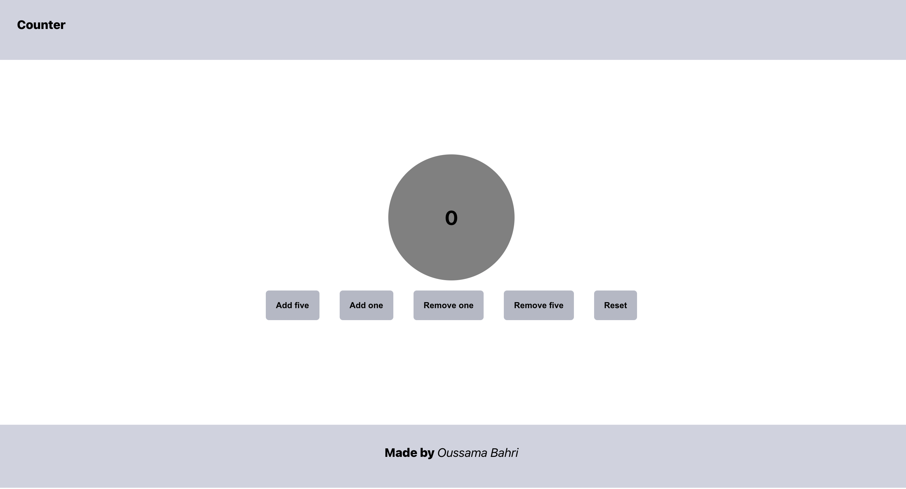

# Counter application

## Description

An application developped with React that allows the user to:

- Increase the counter by 1 or 5
- Decrease the counter by 1 or 5
- Reset the counter to 0.

## Notions applied

- Use of class component
- Interacting with the state and appliying defined methods

## Screenshot

